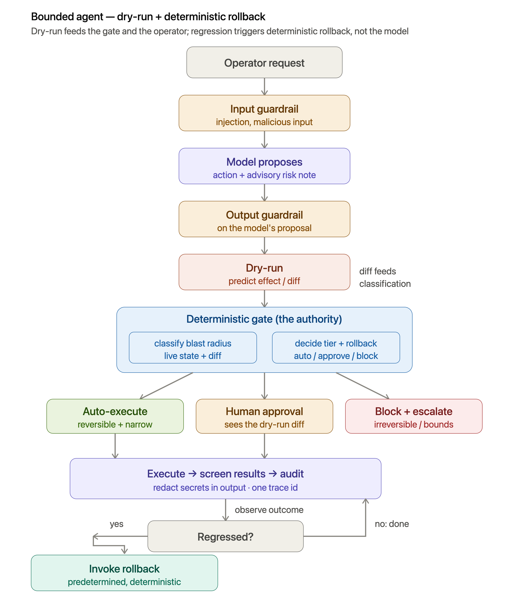

# Bounded Kubernetes AI Agent Proof-of-Concept

A demonstration of a secure, bounded AI agent for Kubernetes operations. An operator describes a problem in natural language; an LLM proposes a structured kubectl-style action with an advisory risk note; a deterministic gate, not the model, classifies the action's blast radius from live cluster state and assigns a tier: auto-execute, require human approval, or block and escalate.

Approved actions execute against a real cluster, everything is audited, and if an action regresses, a predetermined deterministic rollback fires automatically.

The core design principle: the model proposes, deterministic code disposes. The LLM's judgment is advisory; all safety-critical decisions live in testable, deterministic logic outside the model's reasoning loop.

## How to Use

### Environment model

The project runs across four independently-checkable layers:

1. **Python venv** — this repo's libraries (`boto3`, `kubernetes`, `requests`, ...).
2. **Docker containers** — MiniStack, serving local Bedrock/IAM/CloudWatch
   API surfaces on `localhost:4566`.
3. **System CLIs** — Ollama (`localhost:11434`), minikube, kubectl, kubescape.
4. **Code** — `safety_core/` (domain-independent safety spine) and
   `k8s_agent/` (Kubernetes-specific domain layer).

`make verify` checks each layer on its own and reports a ✓/✗ per layer, so a
failure tells you exactly which one is down rather than a generic
"environment not ready."

### Prerequisites

Install these yourself — they are system tools, not Python packages, and are
never installed via `requirements.txt`:

- [Docker](https://www.docker.com/) (running MiniStack)
- [minikube](https://minikube.sigs.k8s.io/) + `kubectl`
- [kubescape](https://kubescape.io/)
- [Ollama](https://ollama.com/)

### 1. Install and start each layer

**Python venv:**

```sh
python3 -m venv .venv
source .venv/bin/activate
pip install -r requirements-dev.txt
cp .env.example .env
```

**Ollama** (local model server):

```sh
ollama pull llama3.1
ollama serve   # if not already running as a background service
```

**MiniStack** (local Bedrock-shaped endpoint, proxying to Ollama):

```sh
docker run -d --name ministack -p 4566:4566 \
  -e MINISTACK_BEDROCK_PROXY_URL=http://host.docker.internal:11434/ \
  ministackorg/ministack:latest
```

The `MINISTACK_BEDROCK_PROXY_URL` env var is what makes MiniStack forward
`converse` calls to your real Ollama instance instead of returning a
generic mock response — without it, `ModelClient` still gets a
well-formed reply, just not a real model completion. `.env`'s
`LAB_USE_AWS` flag switches `ModelClient`/`ClusterClient` between this
local endpoint and real AWS with the same code.

**minikube** (local Kubernetes cluster):

```sh
minikube start
make seed     # applies manifests/seed/ — the demo namespaces/deployments/PDBs
```

`make reset` restores this same clean state later (e.g. after a demo run
that scaled or deleted something). `make seed`/`make reset` are also what
generate the rollout history some seeded deployments need.

**Verify everything is up:**

```sh
make verify
```

Checks each of the four layers independently and reports a ✓/✗ per layer,
so a failure tells you exactly which one is down rather than a generic
"environment not ready." It's fine — and expected — to have some layers
down; the point is knowing which.

`make verify-foundation` is a different, complementary check: not whether
the runtime environment is reachable, but whether the *repo itself* is
still structurally sound — `safety_core/` stays domain-independent (a
grep for Kubernetes/AWS-specific terms leaking into it), expected
scaffolding exists, `.env.example` hygiene holds. Safe to re-run any
time as the project grows, not just at initial setup.

### 2. Run the tests

```sh
make test              # full suite: unit tests always run; integration
                        # tests skip gracefully (not fail) if MiniStack/
                        # Ollama/minikube aren't reachable
make test-integration   # only the integration-marked tests — requires the
                        # live, seeded stack from step 1
```

`pytest --cov=safety_core --cov-report=term-missing` reports coverage on
the deterministic core specifically (target: ≥90%; currently ~99%).

### 3. Run a request through the agent

The interactive way — a `rich`-formatted REPL that shows the curated
decision path and, on APPROVE-tier, prompts for approve/reject before
executing:

```sh
make cli                  # or: python3 -m k8s_agent.cli
```

Or call the loop directly (still the right way to script something
non-interactively, e.g. from `handle_code_push`):

```python
from k8s_agent.agent import run_agent_loop
from k8s_agent.model_client import ModelClient
from k8s_agent.cluster import ClusterClient
from k8s_agent.audit_sink import StdoutAuditSink
from safety_core.guardrails import Guardrails
from safety_core.audit import Auditor

result = run_agent_loop(
    "The healthy-web deployment in bounded-agent-demo needs to scale to 4 replicas.",
    model_client=ModelClient(),
    cluster_client=ClusterClient(),
    guardrails=Guardrails(),
    auditor=Auditor(StdoutAuditSink()),
)
print(result.outcome, result.decision)
```

This runs the full screen → propose → validate → classify → act → audit
pipeline against your live stack: `StdoutAuditSink` prints one JSON line
per audit step (trace id, action, decision, detail), and `result.decision`
carries the gate's tier, its reason, and (when relevant) the rollback plan
and success criterion.

### Watching the system

Four streams are worth watching, each for a different audience:

1. **The operator terminal** — `make cli` (or `python3 -m k8s_agent.cli`).
   The curated decision view: request → screened → proposed → validated →
   classified, color-coded by tier (green AUTO, yellow APPROVE, red
   BLOCK), and on APPROVE-tier the full approval prompt before it asks
   approve/reject. This is deliberately *not* a log — full detail lives in
   the audit stream below.
2. **The audit stream** — `tail -f audit_logs/<file>.jsonl` (the CLI
   prints the exact path at startup). One JSON line per step of every
   trace, in full: `trace_id`, `timestamp`, `step`, `action`, `decision`,
   `detail`. Use the trace id printed in the operator terminal to pull the
   full detail behind one decision: `grep <trace-id>
   audit_logs/<file>.jsonl`.
3. **Ollama, verbose** — the model's raw request/response. If Ollama is
   running as a local process, its own stdout shows each request; if it's
   containerized, `docker logs -f ollama` (or your container's name).
4. **Docker/MiniStack, verbose** — `docker logs -f ministack` shows the
   Bedrock-proxy round trips between `ModelClient` and Ollama.

### Not yet built

- **Automatic rollback invocation** — `RollbackPlan`s are generated and
  attached to every `Decision`, but nothing yet observes post-execution
  state and invokes one automatically on regression.
  `safety_core.success.check_regression` and `RollbackRegistry` exist and
  are unit-tested, just not wired into the live loop.
- **Kubescape scan → remediate → rescan loop** — no Kubescape integration
  exists in `k8s_agent/` yet.
- **Web UI** — the operator console is terminal-only (`k8s_agent/cli.py`);
  a web UI is a possible post-M5 follow-up, not started.

## Bounded AI Agent Design Overview



## Four Controls

This design uses four controls to constrain an agent's influence, listed in order of a request flow:

(1) Guardrails; model boundary

- filters input and output
- the authority/final check (unless escalated to HITL)

(2) Policy Decision Point (PDP); action boundary

- deterministic allow/deny
- the authority/final check

(3) Scoped IAM; privilege floor

- least-privilege credentials
- even a gate can't exceed this

(4) Observability; across layers

- guardrails and refusal rates as signals
